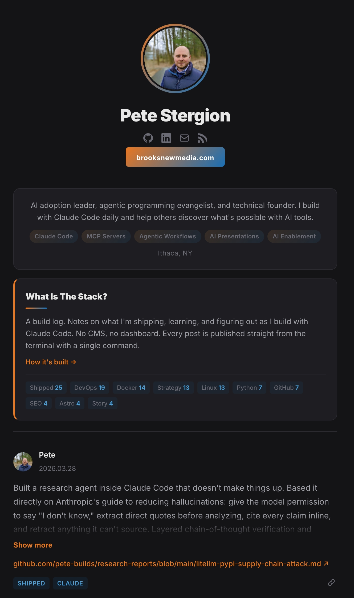

# The Stack: A Terminal-Native Microblog

A microblog you publish from [Claude Code](https://claude.ai/claude-code) with a single slash command. Built with Astro, deployed via rsync. No CMS, no database, no admin panel. Just markdown files, a build step, and a server you control.

**Live example:** [stack.brooksnewmedia.com](https://stack.brooksnewmedia.com)



## Features

- Dark theme with orange/blue accent gradient
- Tag filtering with counts
- RSS feed
- Paginated feed (10 posts per page)
- Individual post pages (`/post/[id]/`)
- Pinned posts (add `Pinned` tag)
- Markdown rendering (bold, lists, code, headers)
- Share button (copy link to clipboard)
- Show more/less for long posts
- Mobile responsive
- Sitemap generation
- Zero JavaScript frameworks (vanilla JS only)

## Quick Start

```bash
git clone https://github.com/pete-builds/astro-claude-microblog.git my-stack
cd my-stack
npm install
npm run dev
```

Open `http://localhost:4321` to see the template.

## Customize Your Site

### Profile and branding

Edit `src/pages/[...page].astro`:
- Replace `Your Name` with your name
- Replace `yoursite.com` with your domain
- Update the bio text and skill pills
- Update social links (GitHub, LinkedIn, email)
- Replace `Your City, ST` with your location

Also update these in `src/pages/tag/[tag].astro` and `src/pages/post/[id].astro`.

### Avatar

Replace `public/images/avatar.svg` with your photo. Any format works (PNG, JPG, SVG). Update the `src` paths in the page files if you change the filename.

### Site metadata

Edit `src/layouts/BaseLayout.astro`:
- Update the default title and description
- Add your analytics tracking code where the comment says `<!-- Add your analytics here -->`

Edit `astro.config.mjs`:
- Replace `https://example.com` with your actual site URL

Edit `public/robots.txt`:
- Replace the sitemap URL with your domain

### Colors

Edit the CSS variables in `src/layouts/BaseLayout.astro`:
```css
:root {
  --orange: #e87722;      /* Primary accent */
  --orange-light: #f09050;
  --blue: #1a6fb5;        /* Secondary accent */
  --blue-light: #4a9fd8;
  --bg-primary: #141416;  /* Page background */
  --bg-card: #1e1e22;     /* Card background */
}
```

## Server Setup

You need a VPS or server to host the built static files. Any provider works: Hetzner, DigitalOcean, Linode, Vultr, or even a Raspberry Pi.

### 1. Get a server

Sign up with a VPS provider and spin up a small instance. A $5/month server is more than enough for a static site.

### 2. Install a web server

```bash
# Ubuntu/Debian
sudo apt update && sudo apt install apache2

# Or Nginx
sudo apt update && sudo apt install nginx
```

### 3. Set up your web root

```bash
sudo mkdir -p /var/www/yoursite
sudo chown your-user:www-data /var/www/yoursite
```

### 4. Point your domain

Add an A record in your DNS pointing your domain (or subdomain) to your server's IP address.

### 5. Set up SSL (free with Let's Encrypt)

```bash
sudo apt install certbot python3-certbot-apache  # or python3-certbot-nginx
sudo certbot --apache -d yoursite.com  # or --nginx
```

Certbot will auto-renew your certificate.

## SSH Key Setup

You need passwordless SSH access so the deploy script can rsync without prompting for a password.

### 1. Generate a key pair (if you don't have one)

```bash
ssh-keygen -t ed25519 -C "your-email@example.com"
```

Press Enter to accept the default location. Set a passphrase or leave blank.

### 2. Copy your public key to the server

```bash
ssh-copy-id your-user@yourserver.com
```

If your server uses a custom SSH port:
```bash
ssh-copy-id -p 2222 your-user@yourserver.com
```

### 3. Test it

```bash
ssh your-user@yourserver.com
```

You should connect without being asked for a password.

### 4. Optional: SSH config

Add this to `~/.ssh/config` for convenience:
```
Host mystack
  HostName yourserver.com
  User your-user
  Port 22
```

Then you can just run `ssh mystack`.

## Deploy Script

Copy `deploy.example.sh` to `deploy.sh` and fill in your server details:

```bash
cp deploy.example.sh deploy.sh
chmod +x deploy.sh
```

Edit `deploy.sh`:
```bash
REMOTE="your-user@yourserver.com"
REMOTE_PATH="/var/www/yoursite/"
SSH_OPTS=""  # e.g., "-p 2222" for custom SSH port
```

Test it manually:
```bash
./deploy.sh
```

This will:
1. Run `astro build` to generate static HTML in `dist/`
2. Use `rsync --delete` to sync the `dist/` folder to your server (the `--delete` flag removes files on the server that no longer exist locally, keeping things clean)
3. Fix file ownership on the server

Once this works, you're ready to automate it with Claude Code.

## Claude Code Skill Setup

Claude Code supports custom slash commands via skill files. Create one to automate the full publish workflow.

### 1. Create the skill file

Copy the included template:
```bash
mkdir -p .claude/commands
cp .claude/commands/stack.md .claude/commands/stack.md
```

Or create `.claude/commands/stack.md` with your own prompt. The included template will:
- Take your raw text input
- Clean it up while keeping your voice
- Generate the next sequential filename
- Write the markdown file with frontmatter
- Run the deploy script
- Commit and push to git

### 2. Use it

In Claude Code, type:
```
/stack Just shipped my first feature. Static site, dark theme, deploys from the terminal.
```

Claude Code will write the post, build the site, deploy it, and commit. One command, post is live.

## Writing Posts

Posts are markdown files in `src/content/posts/`. Each file has this format:

```markdown
---
date: "2025-01-15T14:30:00-05:00"
text: "Your post content here. Supports **bold**, lists, `code`, and links."
tags: ["Shipped", "DevOps"]
link: "https://optional-link.com"
---
```

### Frontmatter fields

| Field | Required | Description |
|-------|----------|-------------|
| `date` | Yes | ISO datetime string |
| `text` | Yes | Post content (markdown supported) |
| `tags` | No | Array of tag strings |
| `link` | No | URL displayed below the post |
| `image` | No | Path to an image |

### Pinning a post

Add `"Pinned"` to the tags array. Pinned posts get a highlighted card style and are never truncated.

### Filename convention

Use sequential numbering: `001-short-slug.md`, `002-another-post.md`. The slug becomes the post's URL (`/post/001-short-slug/`).

## DNS and SSL Notes

- Point an A record to your server IP
- Use a subdomain like `stack.yoursite.com` if you want to keep it separate from your main site
- Let's Encrypt (via Certbot) gives you free SSL certificates that auto-renew
- Test your SSL at [ssllabs.com/ssltest](https://www.ssllabs.com/ssltest/)

## Project Structure

```
├── astro.config.mjs          # Site URL and integrations
├── deploy.example.sh         # Deploy script template
├── public/
│   ├── images/avatar.svg     # Your avatar
│   ├── favicon.png           # Browser tab icon
│   └── robots.txt            # Search engine directives
├── src/
│   ├── components/
│   │   └── Markdown.astro    # Markdown renderer
│   ├── layouts/
│   │   └── BaseLayout.astro  # Global styles and head
│   ├── pages/
│   │   ├── [...page].astro   # Main feed (paginated)
│   │   ├── post/[id].astro   # Individual post pages
│   │   ├── tag/[tag].astro   # Tag filter pages
│   │   └── rss.xml.ts        # RSS feed generator
│   └── content/
│       └── posts/            # Your markdown posts
└── .claude/
    └── commands/
        └── stack.md          # Claude Code slash command
```

## License

MIT

---

Built by [Pete Stergion](https://stack.brooksnewmedia.com) with Claude Code.
